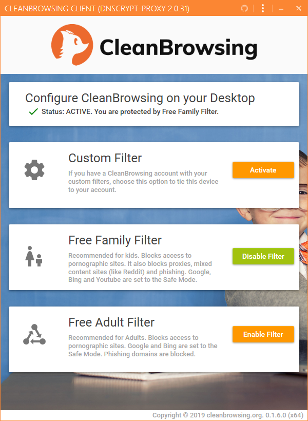
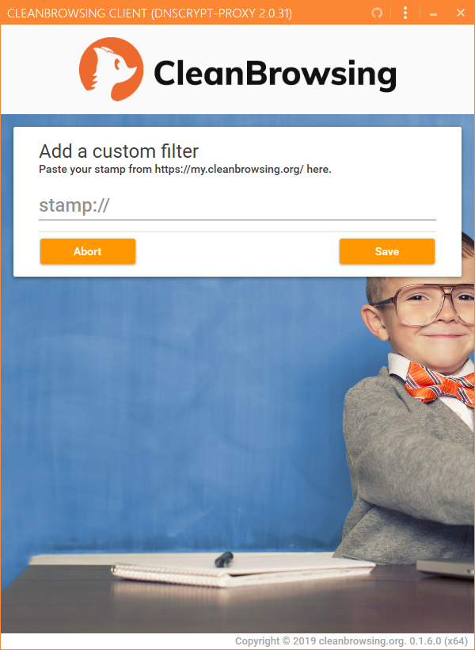
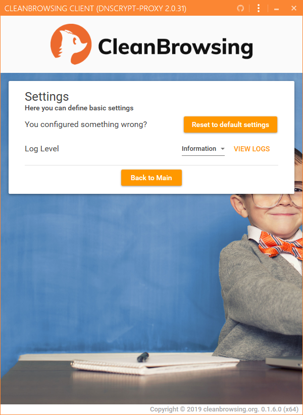
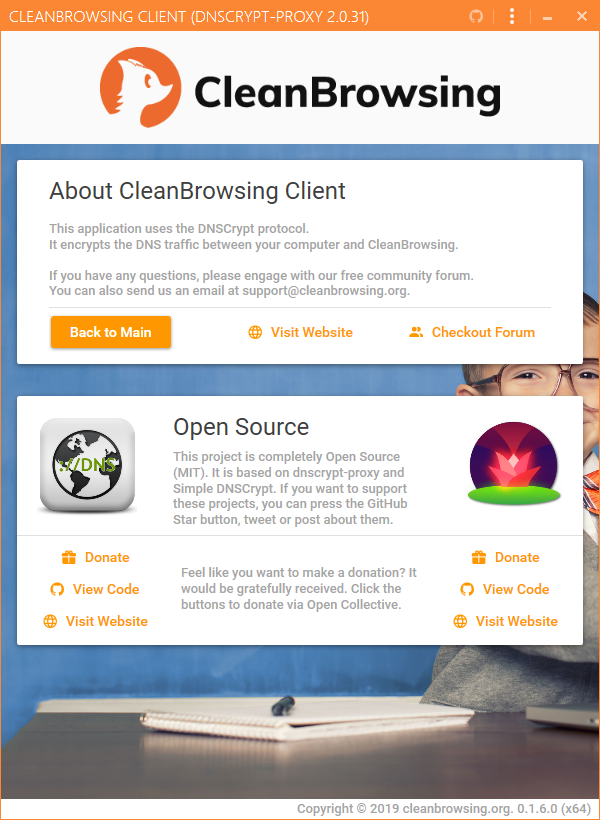

  

============

Windows Desktop Client for [cleanbrowsing.org](https://cleanbrowsing.org) (with [DNSCrypt](https://dnscrypt.info))

[Download latest Windows Installer (x86/x64)](https://github.com/bitbeans/CleanBrowsingClient/releases/download/0.2.2.0/CleanBrowsingClient_Setup.exe)

## Alternatives

You want to use DNSCrypt with another server or provider?
Then have a look at [bitbeans/SimpleDnsCrypt](https://github.com/bitbeans/SimpleDnsCrypt "SimpleDnsCrypt")

> **Note:** Clean Browsing Client will **not** replace the Simple DNSCrypt project! 

## Screenshots

## Built With

* [Visual Studio 2019](https://www.visualstudio.com/downloads/)
* [.NET Core 3.0](https://dotnet.microsoft.com/download/dotnet-core/3.0)

## Authors

* **Christian Hermann** - [bitbeans](https://github.com/bitbeans)

See also the list of [Contributors.md](Contributors.md) who participated in this project. 
If you are a translator, feel free to update this file.

## License

This project is licensed under the MIT License - see the [LICENSE](LICENSE) file for details.

All logos and images are copyrighted by cleanbrowsing.org.

## Used Software and Libraries

- [DnsCrypt.Toolbox](https://github.com/bitbeans/DnsCrypt.Toolbox)
- [helper-net](https://github.com/bitbeans/helper-net)
- [MahApps.Metro](https://github.com/MahApps/MahApps.Metro)
- [Material Design In XAML Toolkit](https://github.com/MaterialDesignInXAML/MaterialDesignInXamlToolkit)
- [Nett](https://github.com/paiden/Nett)
- [Serilog](https://github.com/serilog/serilog)
- [Prism](https://github.com/PrismLibrary/Prism)
- [Simple DNSCrypt](https://github.com/bitbeans/SimpleDnsCrypt)
- [dnscrypt-proxy](https://github.com/DNSCrypt/dnscrypt-proxy)
